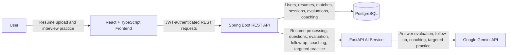

# InterviewAce AI

InterviewAce AI is a full-stack, AI-assisted career and interview preparation platform. It helps users analyze resumes, compare detected skills with job descriptions, and practice text or voice interviews. Users can receive actionable answer feedback and adaptive follow-ups, replay completed sessions, generate coaching plans, target weak areas, and track progress over time.

## Key Features

### Resume Management

- Upload PDF resumes for authenticated users.
- Store, list, retrieve, and delete owned resumes.
- Extract resume text and normalized technical skills.

### Resume Analysis

- Calculate an explainable ATS-style heuristic score.
- Highlight detected strengths, areas to improve, recommendations, and technical skills.
- Break the score into documented resume-quality signals.

> The ATS-style score is a heuristic resume-quality indicator and is not an official score from an ATS vendor.

### Job Match

- Paste a job description and compare its required skills with a selected resume.
- Review matched skills, missing skills, additional resume skills, category breakdowns, strengths, and recommendations.
- Revisit previous match analyses for each resume.

> Job Match measures detected skill alignment and does not predict hiring probability.

### Interview Practice

- Practice in text or browser-assisted voice mode.
- Choose Technical, HR, or Mixed interviews; difficulty; and a question count from 3 to 20.
- Optionally use an analyzed resume to ground questions in detected skills.
- Save answers independently from evaluation and complete sessions when ready.

### Voice Interview

- Capture answers with the browser microphone and speech-recognition APIs.
- Review and edit the transcript before saving it.
- Read questions aloud with browser text-to-speech.
- Fall back to text mode when speech recognition is unavailable.
- Store the submitted transcript only; the current implementation does not upload or store raw audio.

### AI Answer Evaluation

- Use Google Gemini to evaluate a saved answer.
- Score relevance, correctness, completeness, and communication.
- Return strengths, areas to improve, missing key points, and an example improved answer.
- Persist completed feedback so it can be reviewed without regenerating it.

### Adaptive Follow-up Questions

- Request an optional Gemini-generated follow-up based on the candidate's saved answer and limited recent context.
- Limit each base question to two adaptive follow-ups.
- Ground follow-ups in supplied answers without fabricating candidate experience.

### Interview History & Analytics

- Review completed and in-progress sessions and their evaluated-answer counts.
- See interview averages plus category, skill, rubric, and chronological performance trends.
- Calculate analytics deterministically from persisted, completed evaluations; unanswered questions are not scored as zero.

### Interview Replay

- Review completed questions, saved answers, and existing AI feedback.
- Replay does not automatically regenerate evaluations.

### AI Coaching

- Generate a coaching summary from completed, saved interview data.
- Review primary focus areas, revision topics, communication tips, recommendations, and a next-practice plan.

### Targeted Weakness Practice

- Start focused practice from a coaching recommendation or selected weak area.
- Generate a short set of 3 or 5 targeted questions, evaluate responses, and review a practice summary.
- Compare results with a source-interview baseline when enough relevant evaluated data exists.

## Tech Stack

### Frontend

- React 19 and TypeScript 5.8
- Vite 7
- React Router 7
- Axios
- Tailwind CSS 4 and project CSS
- React Hook Form, Zod, and React Icons

### Backend

- Java 21 and Spring Boot 3.5
- Spring Security and JWT authentication
- Spring Data JPA and Jakarta Validation
- Maven
- Springdoc OpenAPI / Swagger UI

### AI Service

- Python 3.12+
- FastAPI, Uvicorn, and Pydantic Settings
- Google Gen AI SDK for Gemini
- PyMuPDF for PDF extraction
- httpx and pytest

### Database

- PostgreSQL
- H2 for backend tests

### Development Tools

- VS Code, Git, and GitHub
- Swagger/OpenAPI
- pytest, Maven tests, ESLint, and the TypeScript/Vite build

## System Architecture



Resume extraction, skill detection, ATS-style scoring, job matching, and base-question generation are deterministic within the AI service. Gemini powers the generative evaluation and coaching workflows.

## User Flow

```mermaid
flowchart LR
    A[Resume Upload] --> B[Resume Analysis]
    B --> C[Job Match]
    C --> D[Interview Practice]
    D --> E[AI Evaluation]
    E --> F[Adaptive Follow-up]
    F --> G[Interview Completion]
    G --> H[Replay]
    H --> I[Coaching]
    I --> J[Targeted Practice]
    J --> K[Progress Tracking]
```



Resume analysis and Job Match are useful preparation steps, but interviews can also be created without attaching a resume.

## Project Structure

```text
InterviewAce-AI/
|-- frontend/       React and TypeScript user interface
|-- backend/        Spring Boot API, security, persistence, and orchestration
|-- ai-service/     FastAPI resume and interview intelligence service
|-- docs/           Architecture, API, database, and requirements documentation
|-- README.md       Project overview and local-development guide
`-- .gitignore      Repository ignore rules
```

## Running Locally

### Prerequisites

- Java 21
- Node.js with npm
- Python 3.12+
- PostgreSQL
- A Gemini API key for generative interview features

InterviewAce runs as three local services. Configure PostgreSQL and environment variables first, then start each service in a separate terminal from the project root.

### 1. Backend API

```powershell
cd backend
.\mvnw.cmd spring-boot:run
```

Linux/macOS: `./mvnw spring-boot:run`

### 2. AI Service

For the first run, create the virtual environment and install dependencies:

```powershell
cd ai-service
python -m venv .venv
.\.venv\Scripts\Activate.ps1
python -m pip install -r requirements.txt
Copy-Item .env.example .env
uvicorn app.main:app --reload --port 8000
```

On Linux/macOS, activate with `source .venv/bin/activate` and copy the example with `cp .env.example .env`.

### 3. Frontend

```powershell
cd frontend
npm install
npm run dev
```

Local endpoints:

- Application: <http://localhost:5173>
- Backend API: <http://localhost:8080>
- AI service: <http://localhost:8000>

## Environment Configuration

Copy the existing [`frontend/.env.example`](frontend/.env.example) and [`ai-service/.env.example`](ai-service/.env.example) files when local overrides are needed. Spring Boot reads its configuration directly from environment variables.

| Service | Variables |
| --- | --- |
| Frontend | `VITE_API_BASE_URL` |
| Backend/database | `DATABASE_URL`, `DATABASE_USERNAME`, `DATABASE_PASSWORD`, `PORT` |
| Backend/security | `JWT_SECRET`, `JWT_EXPIRATION`, `FRONTEND_URL` |
| Backend/integration | `RESUME_UPLOAD_DIR`, `MAX_RESUME_SIZE`, `AI_SERVICE_URL`, `AI_CONNECT_TIMEOUT_MS`, `AI_READ_TIMEOUT_MS` |
| AI service | `AI_SERVICE_HOST`, `AI_SERVICE_PORT`, `MAX_RESUME_SIZE`, `GEMINI_API_KEY`, `GEMINI_MODEL` |

The backend supplies development defaults for several settings, but database credentials and a strong JWT secret should be provided explicitly outside development. Do not commit `.env` files, API keys, database passwords, JWT secrets, or credentials.

## Testing

Run each command from its service directory.

### AI Service

```powershell
python -m pytest
```

The AI service includes automated API and unit tests for resume analysis, matching, question generation, evaluation, follow-ups, coaching, and targeted practice.

### Backend

```powershell
.\mvnw.cmd clean test
```

Linux/macOS: `./mvnw clean test`

The backend includes Spring context, service, mapper, analytics, storage, matching, interview, and evaluation tests.

### Frontend

```powershell
npm run lint
npm run build
```

These commands run ESLint and the production TypeScript/Vite build checks.

## API Documentation

With the services running, interactive API documentation is available at:

- Spring Boot Swagger UI: <http://localhost:8080/swagger-ui/index.html>
- Spring Boot OpenAPI JSON: <http://localhost:8080/v3/api-docs>
- FastAPI Swagger UI: <http://localhost:8000/docs>
- FastAPI OpenAPI JSON: <http://localhost:8000/openapi.json>

The FastAPI endpoints are internal service endpoints and are normally called by the Spring Boot backend. The repository also contains an existing [API contract](docs/API_CONTRACT.md); when it differs from live Swagger output, treat the implemented routes and generated OpenAPI document as authoritative.

## Screenshots

Screenshots are intentionally not fabricated or linked before assets exist. See [`docs/screenshots/README.md`](docs/screenshots/README.md) for the recommended filenames and capture checklist.

## Security & Privacy

- Spring Security protects application endpoints with stateless JWT authentication; registration, login, health, and API-documentation endpoints are public.
- Resume, job-match, interview, replay, evaluation, analytics, coaching, and targeted-practice records are resolved against the authenticated user's ownership.
- Voice mode stores only the transcript submitted by the user; raw microphone audio is not uploaded or stored in the current implementation.
- Secrets and service configuration are supplied through environment variables and ignored local `.env` files.
- The platform does not calculate hiring probability or perform personality inference, accent scoring, or webcam analysis.

These safeguards describe the current application design and do not imply a security certification.

## AI Usage Disclaimer

- AI feedback and coaching are advisory tools for interview preparation.
- ATS-style scoring is heuristic and is not an official vendor ATS result.
- Skill matching describes detected alignment and is not a hiring prediction.
- AI-generated output can be incomplete or incorrect and should be reviewed critically.

## Future Improvements

- Production deployment and environment hardening
- Stronger cross-browser voice-recognition support
- Improved frontend code splitting and performance
- Richer progress visualizations
- Optional external speech-to-text fallback
- Broader question-bank customization

## Project Purpose

InterviewAce AI is a full-stack, AI-assisted interview preparation application built as a portfolio and final-year software project. It demonstrates a three-service architecture, authenticated data ownership, deterministic analysis, responsible generative-AI integration, and automated testing without claiming to replace professional career advice or real hiring decisions.

## Further Documentation

- [Architecture](docs/ARCHITECTURE.md)
- [API contract](docs/API_CONTRACT.md)
- [Database design](docs/DATABASE_DESIGN.md)
- [Project requirements](docs/PROJECT_REQUIREMENTS.md)
