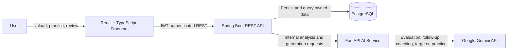

# Architecture Overview

InterviewAce AI uses a three-service architecture: a React frontend, a Spring Boot application API, and an internal FastAPI AI service. PostgreSQL is the system of record, while Google Gemini is called only by generative interview workflows.

## Components and Responsibilities

### React Frontend

- Provides registration, authentication, resume, Job Match, interview, replay, coaching, targeted-practice, and analytics interfaces.
- Sends JWT-authenticated requests to the Spring Boot API.
- Implements voice capture with browser speech recognition and question playback with browser text-to-speech.
- Lets the user edit a recognized transcript before submitting it; it does not upload raw audio.

### Spring Boot Backend

- Owns authentication, authorization, user-scoped resource access, validation, and REST contracts.
- Stores resume metadata and extracted analysis, Job Match history, interview sessions, answers, evaluations, coaching, and analytics data in PostgreSQL.
- Orchestrates calls to the internal FastAPI service and persists returned results.
- Calculates dashboard and interview analytics deterministically from persisted completed evaluations.

### FastAPI AI Service

- Extracts text from PDF resumes with PyMuPDF.
- Detects normalized technical skills, calculates the ATS-style heuristic score, compares skills, and generates base interview questions deterministically.
- Uses Gemini for answer evaluation, adaptive follow-up questions, coaching, and targeted weakness-practice questions.
- Does not persist application records; Spring Boot remains responsible for persistence.

### PostgreSQL

- Stores user accounts, owned resumes and analyses, Job Match results, interview questions and answers, evaluations, coaching reports, and progress data.

### Google Gemini

- Receives the bounded context required for generative interview tasks from FastAPI.
- Is not used for the deterministic ATS-style score, skill extraction, Job Match calculation, base question bank, or persisted analytics.

## System Diagram

## Core Flows

### Authentication and Ownership

1. A user registers or logs in through the frontend.
2. Spring Security validates credentials and issues a JWT.
3. The frontend attaches the JWT to subsequent API requests.
4. Backend services resolve resumes, matches, interviews, evaluations, and reports using the authenticated user's ID.

### Resume Analysis and Job Match

1. The frontend uploads a PDF to Spring Boot.
2. Spring Boot stores the owned resume and calls FastAPI for in-memory PDF extraction, normalized skill detection, and heuristic scoring.
3. Spring Boot persists the returned analysis.
4. For Job Match, FastAPI compares detected resume skills with skills detected in the pasted job description; Spring Boot stores each result for history.

### Interview and Evaluation

1. The user chooses interview type, difficulty, question count, mode, and optionally a resume.
2. FastAPI selects deterministic base questions, using detected resume skills when supplied.
3. Spring Boot persists the session and questions.
4. The user saves a text answer or an editable browser-generated voice transcript.
5. On explicit evaluation, FastAPI sends bounded answer context to Gemini and Spring Boot persists the result.
6. An optional adaptive follow-up is grounded in the saved answer and limited recent context, with at most two follow-ups per base question.

### Replay, Coaching, and Targeted Practice

1. Replay reads persisted questions, answers, and existing evaluations without regenerating them.
2. Coaching sends selected completed interview data to FastAPI and persists the Gemini-generated report.
3. Targeted practice uses a chosen focus area and optional source-interview weakness context to generate 3 or 5 questions.
4. The backend compares completed targeted-practice evaluations with a relevant source baseline when sufficient data exists.

## API Boundaries

- Browser to backend: `http://localhost:8080/api`
- Backend Swagger UI: `http://localhost:8080/swagger-ui/index.html`
- Internal AI service: `http://localhost:8000`
- FastAPI Swagger UI: `http://localhost:8000/docs`

Only the Spring Boot API is intended as the browser-facing application API. FastAPI provides internal processing endpoints and does not implement the application's JWT ownership layer.
