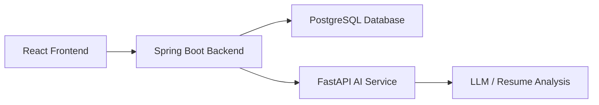

# Architecture Overview

## Frontend Responsibilities
The React + TypeScript frontend will provide:
- User registration and login interfaces
- Resume upload experience
- Interview session UI
- Feedback and scoring visualization
- Progress tracking dashboards

## Spring Boot Backend Responsibilities
The Spring Boot backend will provide:
- Authentication and authorization
- User and profile management
- Resume metadata and session persistence
- API endpoints for frontend integration
- Integration with PostgreSQL and the AI service

## FastAPI AI Service Responsibilities
The FastAPI AI service will provide:
- Resume text extraction and parsing workflows
- Skill extraction and resume analysis
- AI-powered resume feedback generation
- Personalized interview question generation
- Answer evaluation and improvement suggestions

## PostgreSQL Responsibilities
PostgreSQL will store:
- User accounts and authentication records
- Resume metadata and processing results
- Interview session history
- Feedback and scoring data
- Performance trends over time

## Authentication Flow
1. User submits credentials through the frontend.
2. The frontend sends authentication requests to the Spring Boot backend.
3. Spring Security validates credentials and issues JWT tokens.
4. The frontend stores the token and includes it in subsequent requests.

## Resume-Processing Flow
1. User uploads a resume from the frontend.
2. The backend receives the file and stores metadata.
3. The backend sends the document to the AI service for parsing and analysis.
4. The AI service extracts text, identifies skills, and returns feedback and score data.
5. The backend persists the results and returns them to the frontend.

## Interview-Generation Flow
1. User selects a target role and interview type.
2. The frontend sends the selection to the backend.
3. The backend requests question generation from the AI service.
4. The AI service returns tailored interview questions.
5. The frontend displays the questions to the user.

## Answer-Evaluation Flow
1. User submits an interview answer.
2. The backend forwards the answer to the AI service for analysis.
3. The AI service evaluates the answer and generates feedback, score, and improved response suggestions.
4. Results are persisted and shown to the user.

## Mermaid Architecture Diagram

