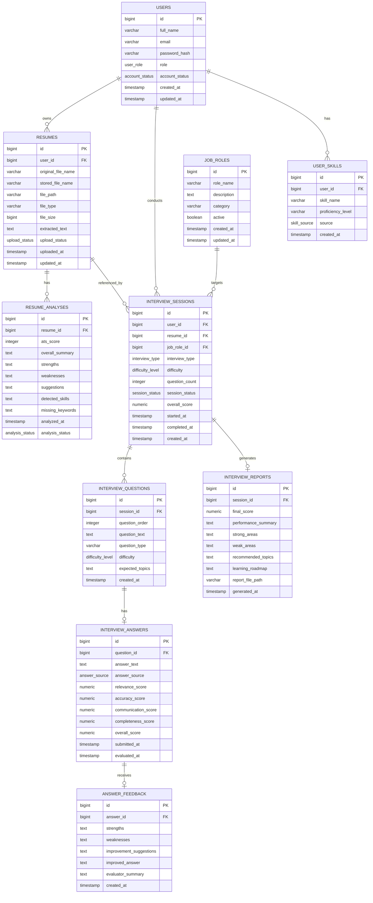

# ER Diagram

## Overview
This diagram shows the main PostgreSQL entities and their relationships for the MVP of InterviewAce AI.

```mermaid
erDiagram
    USERS ||--o{ RESUMES : owns
    USERS ||--o{ INTERVIEW_SESSIONS : conducts
    USERS ||--o{ USER_SKILLS : has

    RESUMES ||--o{ RESUME_ANALYSES : has
    RESUMES ||--o{ INTERVIEW_SESSIONS : referenced_by

    JOB_ROLES ||--o{ INTERVIEW_SESSIONS : targets

    INTERVIEW_SESSIONS ||--o{ INTERVIEW_QUESTIONS : contains
    INTERVIEW_QUESTIONS ||--o| INTERVIEW_ANSWERS : has
    INTERVIEW_ANSWERS ||--o| ANSWER_FEEDBACK : receives
    INTERVIEW_SESSIONS ||--o| INTERVIEW_REPORTS : generates

    USERS {
        bigint id PK
        varchar full_name
        varchar email
        varchar password_hash
        user_role role
        account_status account_status
        timestamp created_at
        timestamp updated_at
    }

    RESUMES {
        bigint id PK
        bigint user_id FK
        varchar original_file_name
        varchar stored_file_name
        varchar file_path
        varchar file_type
        bigint file_size
        text extracted_text
        upload_status upload_status
        timestamp uploaded_at
        timestamp updated_at
    }

    RESUME_ANALYSES {
        bigint id PK
        bigint resume_id FK
        integer ats_score
        text overall_summary
        text strengths
        text weaknesses
        text suggestions
        text detected_skills
        text missing_keywords
        timestamp analyzed_at
        analysis_status analysis_status
    }

    JOB_ROLES {
        bigint id PK
        varchar role_name
        text description
        varchar category
        boolean active
        timestamp created_at
        timestamp updated_at
    }

    INTERVIEW_SESSIONS {
        bigint id PK
        bigint user_id FK
        bigint resume_id FK
        bigint job_role_id FK
        interview_type interview_type
        difficulty_level difficulty
        integer question_count
        session_status session_status
        numeric overall_score
        timestamp started_at
        timestamp completed_at
        timestamp created_at
    }

    INTERVIEW_QUESTIONS {
        bigint id PK
        bigint session_id FK
        integer question_order
        text question_text
        varchar question_type
        difficulty_level difficulty
        text expected_topics
        timestamp created_at
    }

    INTERVIEW_ANSWERS {
        bigint id PK
        bigint question_id FK
        text answer_text
        answer_source answer_source
        numeric relevance_score
        numeric accuracy_score
        numeric communication_score
        numeric completeness_score
        numeric overall_score
        timestamp submitted_at
        timestamp evaluated_at
    }

    ANSWER_FEEDBACK {
        bigint id PK
        bigint answer_id FK
        text strengths
        text weaknesses
        text improvement_suggestions
        text improved_answer
        text evaluator_summary
        timestamp created_at
    }

    INTERVIEW_REPORTS {
        bigint id PK
        bigint session_id FK
        numeric final_score
        text performance_summary
        text strong_areas
        text weak_areas
        text recommended_topics
        text learning_roadmap
        varchar report_file_path
        timestamp generated_at
    }

    USER_SKILLS {
        bigint id PK
        bigint user_id FK
        varchar skill_name
        varchar proficiency_level
        skill_source source
        timestamp created_at
    }
```
